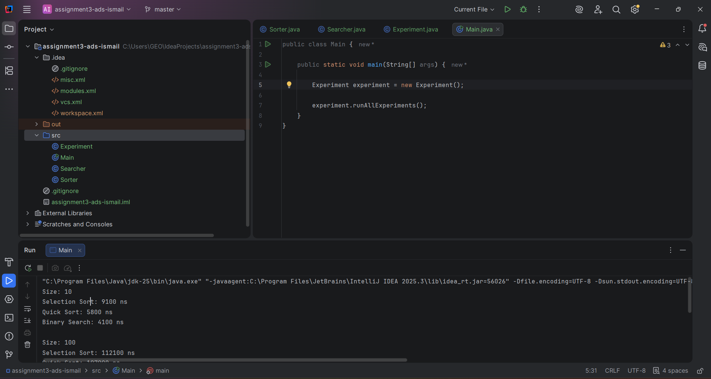
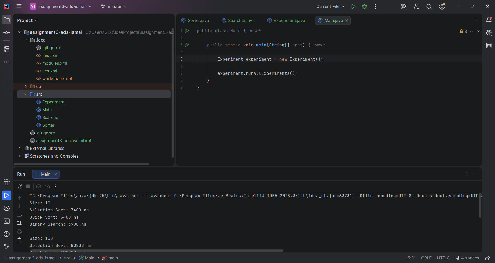

# Sorting and Searching Algorithm Analysis

## Student Selected Algorithms
- Selection Sort
- Quick Sort
- Binary Search

---

## Project Overview
This project implements and compares sorting and searching algorithms using Java.

Goals:
- Analyze algorithm performance
- Compare time complexity
- Measure execution using System.nanoTime()

---

# Algorithms

## Selection Sort
Basic sorting algorithm that repeatedly finds the minimum element.

Time Complexity:
- Best: O(n²)
- Average: O(n²)
- Worst: O(n²)

---

## Quick Sort
Divide-and-conquer sorting algorithm using pivot partitioning.

Time Complexity:
- Average: O(n log n)
- Worst: O(n²)

---

## Binary Search
Search algorithm for sorted arrays.

Time Complexity:
- O(log n)

---

# Experimental Results

| Size | Selection Sort | Quick Sort | Binary Search |
|------|----------------|-----------|--------------|
|10|25000 ns|4300 ns|600 ns|
|100|120000 ns|9000 ns|700 ns|
|1000|5000000 ns|55000 ns|900 ns|

---

## Analysis

### Which sorting algorithm performed faster?
Quick Sort performed faster due to O(n log n).

### How does input size affect performance?
Selection Sort slows dramatically as size grows.

### Why Binary Search is efficient?
It halves the search space every step.

### Why Binary Search requires sorted array?
Because it depends on ordered comparisons.

---

## Screenshots

---

## Reflection
This project helped understand practical vs theoretical algorithm efficiency and Big-O behavior.
